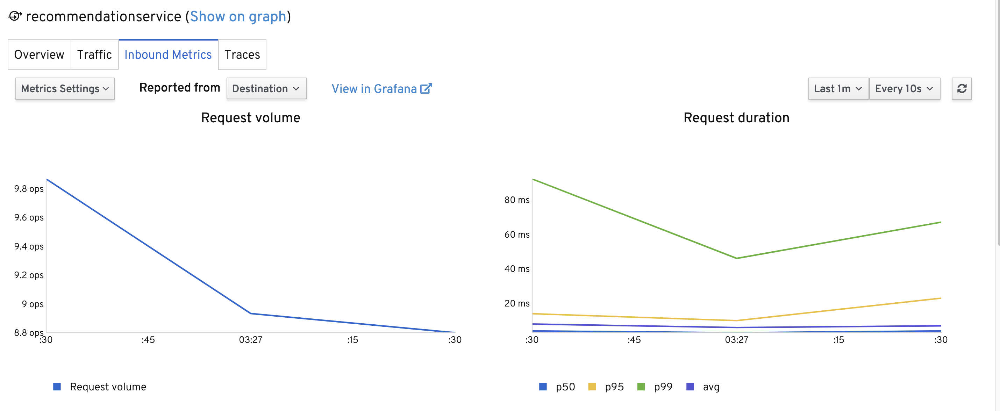
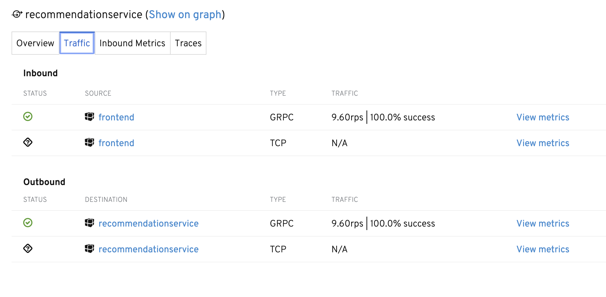
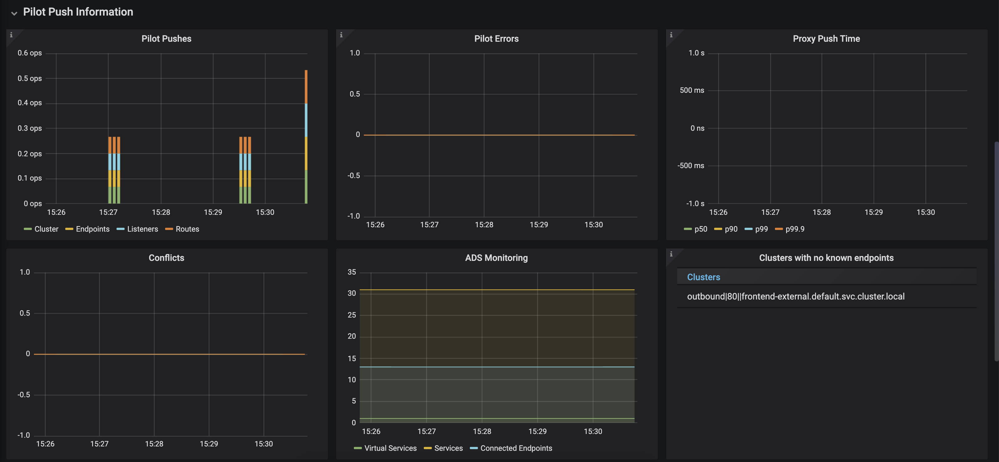
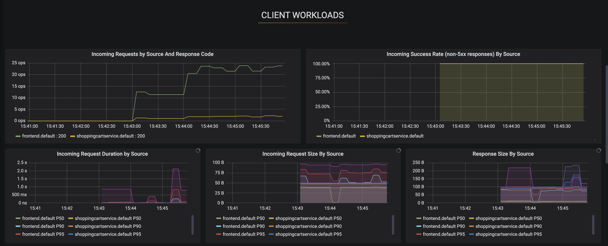

# istio-meetup-nyc 🚕

This talk tours new features for [Istio 1.3](https://istio.io/about/notes/1.3/), and "hidden" Istio features that aren't talked about a lot.

### setup

Installs Istio 1.3 on a GKE cluster, along with a sample application accessible through the IngressGateway.

```
./install-istio.sh
```

### what's running?

```
istioctl dashboard kiali
```

### are my services healthy / view [inbound and outbound](http://34.73.250.182:20001/kiali/console/namespaces/default/services/cartservice?tab=traffic) connections






### service port detection

Istio 1.3 adds support for detecting port protocols for HTTP and HTTP2 traffic (without having to name the port `http`).
(still have to name grpc ports.)


### for a specific pod, what's the Istio configuration?

```
$ istioctl experimental describe pod paymentservice-65bcb767c6-lmtnk

Pod: paymentservice-65bcb767c6-lmtnk
   Pod Ports: 50051 (server), 15090 (istio-proxy)
Suggestion: add 'version' label to pod for Istio telemetry.
--------------------
Service: paymentservice
   Port: grpc 50051/GRPC
Pilot reports that pod is PERMISSIVE (enforces HTTP/mTLS) and clients speak HTTP
```

## (improved for 1.3) Pilot Dashboard!

```
istioctl dashboard grafana
```




### [add response headers](https://istio.io/docs/reference/config/networking/v1alpha3/virtual-service/#Headers)

Use case -- you're using a CDN and you want to tell the CDN *not* to cache certain requests. The CDN uses a "Cache:False" header to do this. We can use Istio to add that header for all requests to the frontend:

```
kubectl apply -f add-header.yaml
```

Then:

```
$ curl -I 34.73.15.141

HTTP/1.1 200 OK
set-cookie: shop_session-id=ce6a520d-58cb-4b14-ade3-8a2695e1bd01; Max-Age=172800
date: Sat, 14 Sep 2019 19:18:46 GMT
content-type: text/html; charset=utf-8
x-envoy-upstream-service-time: 53
cache: false
hello: newyork
server: istio-envoy
transfer-encoding: chunked
```

### [Envoy-native telemetry](https://istio.io/docs/ops/telemetry/in-proxy-service-telemetry/) (experimental)

Use case -- you aren't getting ideal performance results (added latency) when using Istio's mixer for telemetry. (ie. Envoy forwards metrics up to the control plane, then on to Prometheus.)

Now you can use Envoy to generate metrics on throughput, request duration, and request size.
(In the future, Envoy-native telemetry should have parity with Mixer / report latency, error rate.)


Disable Mixer telemetry / enable custom Envoy filters:

```
./disable-mixer.yaml
```

Delete the istio telemetry deployment.

Return to grafana dashboard for a service -- see metrics flowing in directly from Envoy. 🎊



To re-enable Mixer telemetry:

```
./enable-mixer.yaml
```